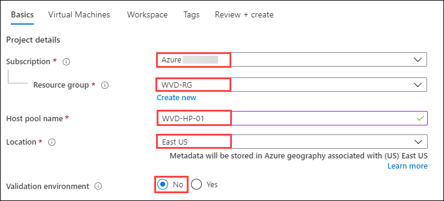
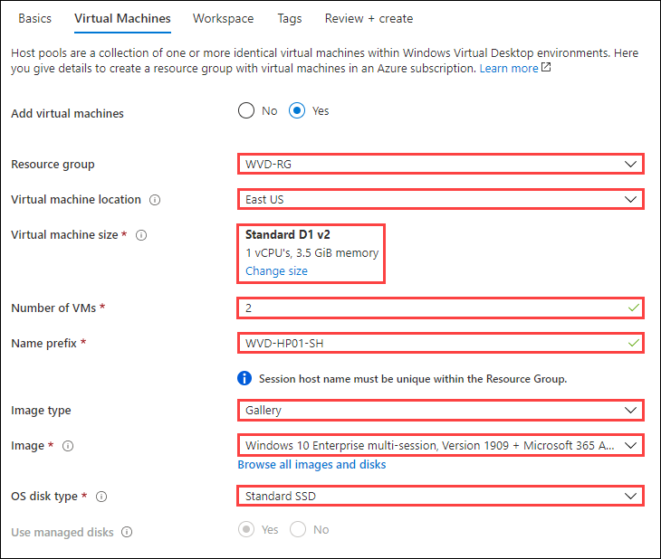
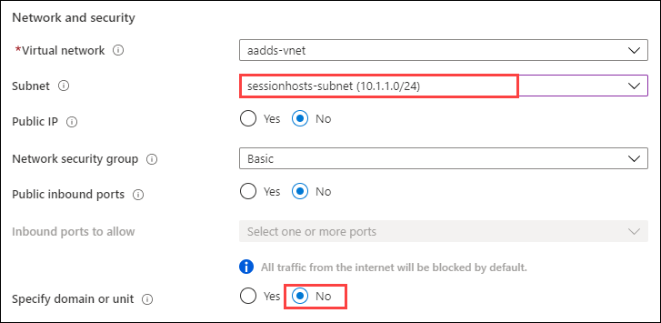
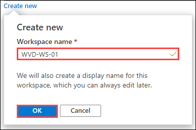
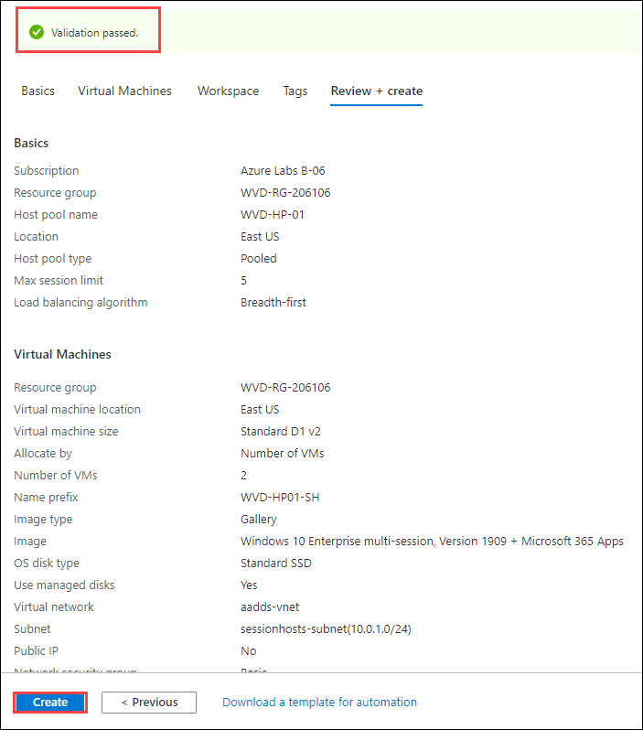
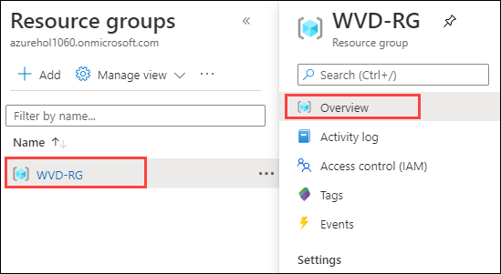
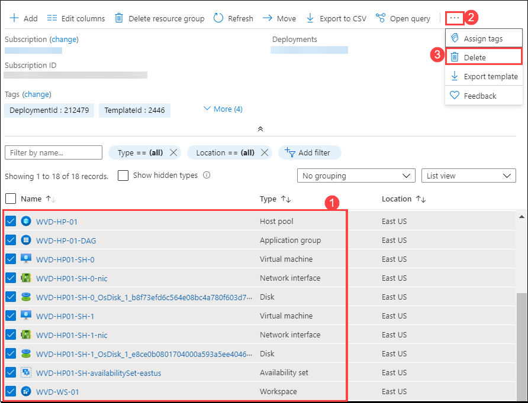
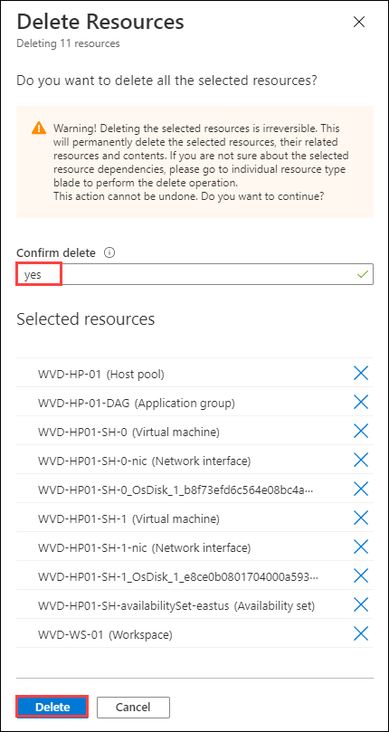

# **Exercise 1: Create Host Pool from Azure Portal** 

 
Host pools are a collection of one or more identical virtual machines within Windows Virtual Desktop environment. Each host pool contains Application groups that users can interact with, as they would be on a physical desktop. To start with, we will login to Azure portal. 
 
 
### **Task 1: Log in to Azure Portal**

1. Open **Azure Portal** (https://portal.azure.com) in your browser. 

2. Login to Azure with the username **<inject key="AzureAdUserEmail" />** and click on **Next**.

   

3. Enter password **<inject key="AzureAdUserPassword" />** and click on **Sign in**.

   

> **Note:** If there's a popup entitled **Stay signed in?** with buttons for **No** and **Yes** - Choose **No**.
>
>  
>   
> **Note:** If there's another popup entitled **Welcome to Microsoft Azure** with buttons for **Start Tour** and **Maybe Later** - Choose **Maybe Later**.
>
>  
  
 
 
### **Task 2: Create Host Pool**

In this exercise, we will create a Host Pool named *WVD-HP-01* of pooled type, then add two session hosts (virtual machines) i.e. *WVD-HP01-SH-0* and *WVD-HP01-SH-1*  and register the default desktop application group from this hostpool to a new workspace named *WVD-WS-01*.

1. On **Azure portal** search for *Windows Virtual Desktop* in the search bar and select **Windows Virtual Desktop** from the suggestions.

   
 

2. You will get directed towards the Windows Virtual Desktop (here after referred to as WVD) management window.  

   

3. Now select **Host pools** under **Manage** blade and then click on **+ Add** to add new Host Pool.

   

4. In this step, we will provide the details required to create a Host Pool. For your convenience, this step is divided into two sections as follows:

 **A.** **Project Details –** Defines the Host Pool environment 

   - Subscription: *Choose the default subscription*.
   - Resource Group: *Select **WVD-RG** from the drop down*.
   - Host Pool Name: **WVD-HP-01**
   - Location: **East US**, *basically this should be same as the region of your resource group*.      
   - Validation environmet: **No**
      
   >**Note:** Validation host pools let you monitor service updates before rolling them out to your production environment.
            
   
   
 **B.** **Host Pool Type –** Defines the type of host pool. 

   - Host pool type: **Pooled** 
   
      
   >**Note:** Host Pools are of 2 types: Pooled and Personal.  
   > - **Pooled** is used to share the same Session Host (Virtual Machine) resources among multiple users.
   > - **Personal** uses a dedicated Session host of individual users.

   - Max session Limit: **5**
   
      
   >**Note:** Max session Limit limits the simultaneous number of users on the same session host.
     
   - Load Balancing Algorithm: **Breadth First**
   
      
   >**Note:** Load Balancing Algorithm is of two types: *Breadth-first* and *Depth-first*. 
   > - **Breadth-first** load balancing distributes new user sessions across all available session hosts in the host pool. 
   > - **Depth-first** load balancing distributes new user sessions to an available session host with the highest number of connections but has not reached its maximum session limit threshold.
     
   - Then click on **Next:Virtual Machines**.
   
     
   
5. In the Virtual machines tab, select **Yes** against **Add virtual machines**. By doing this, we are stepping towards adding Virtual machines to the host pool. 

   

6. In this step, we will provide the details of the VMs to be created as session Hosts. For your convenience, this step is divided into three sections as follows:

  **A**. Session Host Specifications:     

   - Resource Group: *Select **WVD-RG** from the drop down*.
   - Virtual machine location: **East US**, *location should be same as location of your resource group*.
   - Virtual machine size: **Standard D1_v2**. *Click on **Change Size**, then select **D1_v2** and click on **Select** as shown below*
   
   

   - Number of VMs: **2**   
   - Name prefix: **WVD-HP01-SH** 
   - Image type: **Gallery**
   - Image: **Windows 10 Enterprise multi-session, version 1909 + Microsoft 365 Apps** *(choose from dropdown)* 
   - OS disk type: **Standard SSD**
   - Use managed disks: *Leave to default*
   
   
    
  **B**. Network and Security:
    Leave all values to default, except:
    
   - Subnet: **sessionhosts-subnet(10.0.1.0/24)** *(choose from dropdown)*
   - Specify Domain or Unit: **No**
 
   
 
  **C**. Administrator Account details:
  
   - AD domain join UPN: *Paste your username* **<inject key="AzureAdUserEmail" />**
   - Password: *Paste the password* **<inject key="AzureAdUserPassword" />**
   - Confirm Password: *Paste the password* **<inject key="AzureAdUserPassword" />** *again.*
   
   
   >**Note:** This Administrator Account details will be used for domain joining the virtual machines to the Windows AD domain we created using AADDS.
   
   
   
   
7. Click on **Next: Workspace** to proceed. 

8. In the Workspace section, we need to specify if we need to register the default application group to a workspace. 

   - Register desktop app group: *Choose* **Yes** 
   - To this workspace: *Click on* **Create new**

   
   
9. Once you click on **Create new**, a small window pops up, where you can specify the Workspace name you are going to create.  

   - Workspace name: **WVD-WS-01** 
   - Click on **OK**
     
    

10. Now click on **Review + create** on the bottom left corner. 

    

11. The last window helps us to verify if the parameters we filled are correct. Wait for validation to pass, then click on **Create** to initiate the deployment. 

    

> **Note:** The deployment will take about 30 minutes to succeed.

12. Once the deployment is succeeded, open notifications and click on **Go to Resource**.  

    

> **Note:** In case the previous deployment for Host Pool fails, follow the below steps. Else, continue from step 13:
>
>i. Go to the **WVD-RG** resource group and click on **Overview**.
>
>    
> 
>ii. Select the resources highlighted in the image below, then click on ellipsis in the top-right corner and click on delete. Make sure you **DO NOT** delete any other resources other than the ones shown in screenshot below.
>
>   
>
>iii. Now under *Confirm delete* type **yes** in the bar and click on **Delete**.
> 
>    
>
>iv. Once the resources get deleted, then perform Task 1 from Step 1 to Step 11 to create the Host Pool again.
>
>
>v. Now wait for the deployment to succeed. When it gets succeeded, open the notifications and click on **Go to Resource**.  
>
>    

14. You will see that the host pool **WVD-HP-01** is created with two session hosts in it and a default application group (of type Desktop).  

    

15. Now click on **Session Hosts** present under **Manage** blade. Here you can view the session hosts created. 

    

16. Click on the **Next** button present in the bottom-right corner of this lab guide.  
