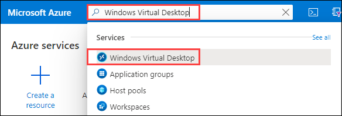
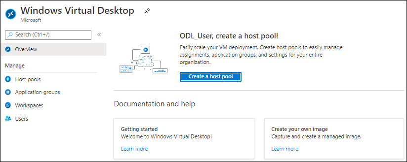
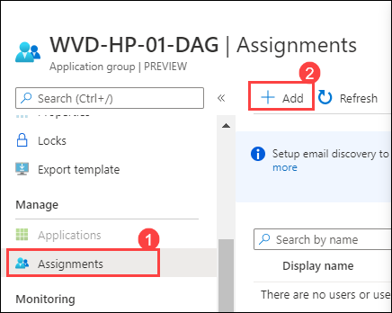
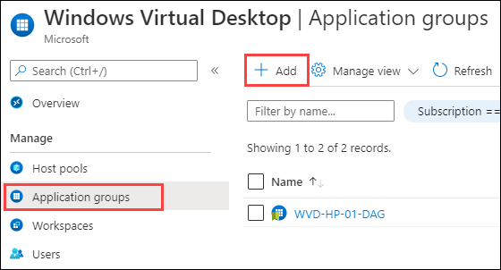
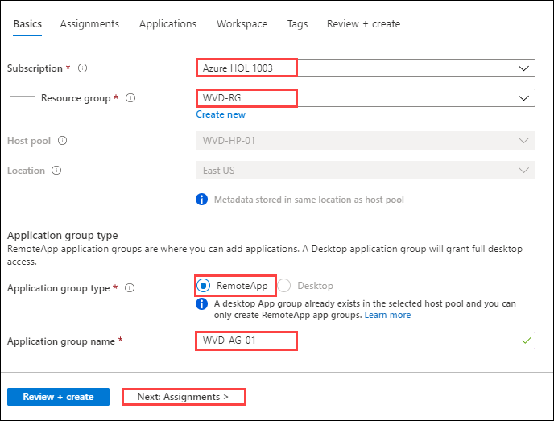
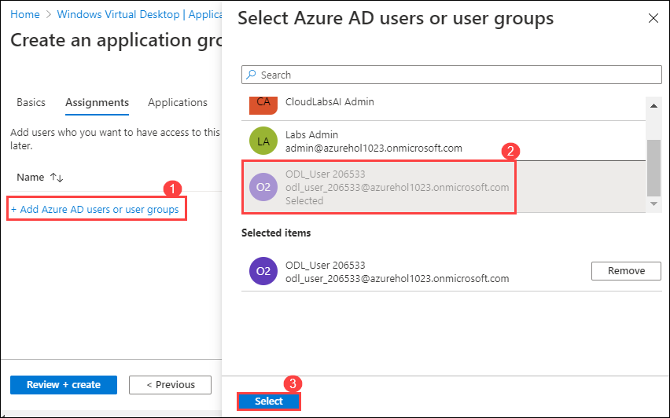
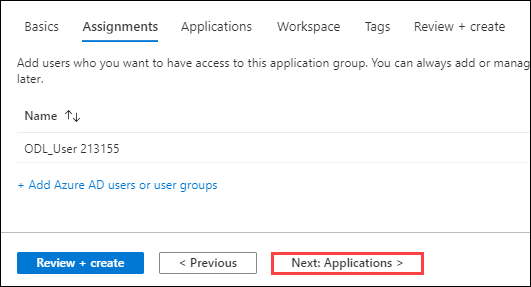
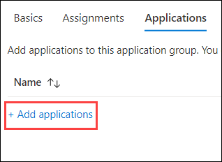
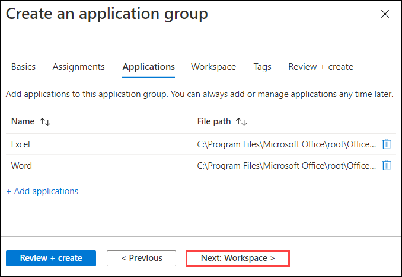
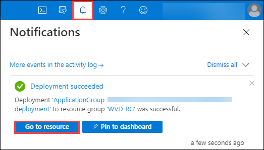

# **Exercise 2: Create Application Groups and assign to users** 

As explained in the General Hierarchy section, Application Group is a logical grouping of applications installed on session hosts in the host pool. They are of two types: 

1. RemoteApp 
2. Desktop 

## **Task 1: Create Application Group**

An application group of type ‘Desktop’ was created automatically while creating the Session Host in previous exercise. Now in this task, we will create a new application group of type ‘*RemoteApp*’ and publish two applications in it. Also, we will assign users to both the application groups.

1. Navigate to Azure portal, then search for *Windows Virtual Desktop* in search bar and select **Windows Virtual Desktop** from the suggestions.

   

2. You will be directed towards the Windows Virtual Desktop management window.  

   

3. Click on the **Application Groups** tab and you will see the default Application Group there. 

   
   
4. Click on **WVD-HP-01-DAG** application group.

   
      
5. Under **Manage** blade, open **Assignments** and then click on **+ Add**. 

      
 
6. Now in the search bar, copy and paste your username **<inject key="AzureAdUserEmail" />**. Then under the search bar, click on your username to select it.

   
   
7. At last click on **Select** button. 
 
    
 
8. We will now create a new Application Group of type ‘RemoteApp’. To do this, navigate back to the **Application groups** and click on the **+ Add** button. 

   

9. For *Basics* section, follow the points mentioned below: 

   i.  Leave the following parameters to default:
   
      - *Subscription*
      - *Host Pool*
      - *Location*
         
   ii.  Fill the left parameters as mentioned below and then click on **Next:Assignments**:  
   
      - Resource Group: *Select **WVD-RG** from the drop down*.
      - Application Group Type: **RemoteApp** 
      - Application Group Name: **WVD-AG-01**

   

10. In the assignments section, you can add the user whom should be given access to WVD solution on this application group. 

11. Click on the **+Add Azure AD users or user groups**, then copy and paste your username **<inject key="AzureAdUserEmail" />** in the search bar. When your username appears under the search bar, select it and then click on **Select** button.
 
   

12. Now click on **Next:Applications**. 

   

13. On the **Applications** section, click on **Add Applications** to add applications to this application group. 

   

14. In this window, choose the parameters as mentioned below: 

   - Application Source: **Start Menu**    
   - Application: **Excel**
   - Leave rest of the parameters to be on default settings and click on **Save**.
   
  
 
15. Click on **Add Applications** again. 

   

16. Choose the parameters as mentioned below: 

   - Application Source: **Start Menu**    
   - Application: **Word**   
   - Leave rest of the parameters to be on default settings and click on **Save**.

   
   

17. Now click on **Next:Workspace**. 

   

18. In the Workspace section, we can choose to register the Application Group now or we can also register it later.  

   - Register Application Group: **Yes**
   - **WVD-WS-01** workspace will be selected by default, since the default ‘Desktop’ type application group on the same Session Host *(WVD-HP01-SH-01)* is registered to this workspace.

   

19. Click on **Review + Create**

   

20. A provision to validate the settings will be available on the validation page. If everything looks correct, click on **Create**. 

   

> **Note:** The deployment will take about 2 minutes to succeed.

21. Once the deployment is complete, open notifications and click on **Go to Resource**. 

   

22. Now in the Application Group Window that comes up, click on **Applications** present under **Manage** and you will see that the applications are published in the application Group. 

   

23. Click on the **Next** button present in the bottom-right corner of this lab guide. 
