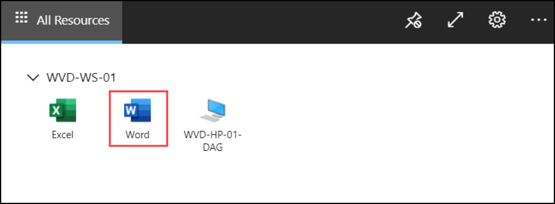

# **Exercise 3: Access the Published Applications/Desktop using Browser**

## **Task 1: Access the Published Application**

Now as we have published remote applications in previous exercise, now we will be accessing them using the web browser.

1. Use the link ```aka.ms/wvdarmweb``` and enter your **credentials** to login. 

   - Username: *Paste your username* **<inject key="AzureAdUserEmail" />** *and then click on **Next**.*
   
   

   - Password: *Paste the password* **<inject key="AzureAdUserPassword" />** *and click on **Sign in**.*

   
  

2. Now you will be directed to the WVD dashboard with all the Desktop and Applications visible. Click on any one of the applications you want to access. Here we are selecting **Word**. 

   


3. Now click on **Allow** for the prompt.

   


4. Enter your **credentials** to access the application and click on **Submit**.

   - Username: **<inject key="AzureAdUserEmail" />** 
  
   - Password: **<inject key="AzureAdUserPassword" />**

   
      
5. Your application will launch and look similar to the one shown below.

   

6. Now close this Word application session.

   
   
## **Task 2: Access the published Desktop**

1. Now on the top-left side click on **All Resources**.
   
   
   
   
2. Here you will be inside the WVD dashboard with all the Desktop and Applications visible. Click on the **WVD-HP-01-DAG** Desktop to access it. 

   


3. Click on **Allow** for the Prompt.

   


4. Enter your **credentials** to access the application and click on **Submit**.

   - Username: **<inject key="AzureAdUserEmail" />** 
  
   - Password: **<inject key="AzureAdUserPassword" />**

   


5. Your virtual Desktop will launch, and it should be ready to use. 

   
   
6. Click on the **Next** button present in the bottom-right corner of this lab guide. 
