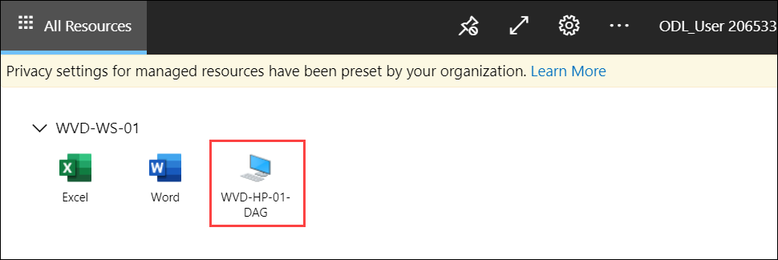
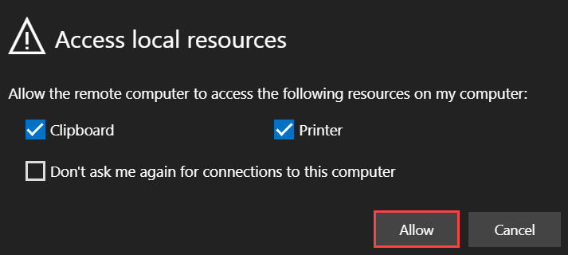
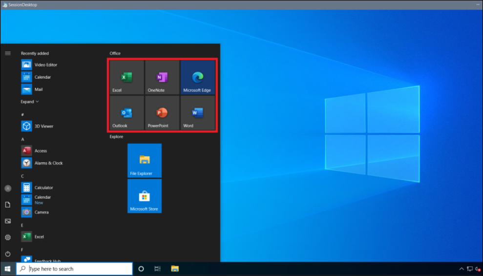

# **Exercise 3: Access the Published Applications/Desktop using Browser**

## **Task 1: Access the Published Application**

In this exercise, we will access the Desktop and RemoteApps assigned to us in the previous exercise using browser.

1. Open the following URL in a new browser tab, this will lead us to the Remote Desktop Web Client.

   ```aka.ms/wvdarmweb``` 

2. Now to login, enter the lab credentials as mentioned below:

   - Username: *Paste your username* **<inject key="AzureAdUserEmail" />** *and then click on **Next**.*
   
   

   - Password: *Paste the password* **<inject key="AzureAdUserPassword" />** *and click on **Sign in**.*

   
  

3. Now the WVD dashboard will launch. Click on **Word** application to access it. Here we are selecting **Word**. 

   


4. Now click on **Allow** for the prompt.

   


5. Enter the lab credentials to access the application and click on **Submit**.

   - Username: **<inject key="AzureAdUserEmail" />** 
  
   - Password: **<inject key="AzureAdUserPassword" />**

   
      
6. The Word application will launch and will look similar to the screenshot below.

   

7. Now close this Word application session.

   
   
## **Task 2: Access the published Desktop**

1. Now on the top-left side, click on **All Resources**.
   
   
   
   
2. We will land on the WVD dashboard again. Click on the tile named WVD-HP-01-DAG to launch the desktop.

   


3. Click on **Allow** for the Prompt.

   


4. Enter the lab credentials to access the application and click on **Submit**.

   - Username: **<inject key="AzureAdUserEmail" />** 
  
   - Password: **<inject key="AzureAdUserPassword" />**

   


5. Now the virtual desktop will launch. 

   
   
6. Click on the **Next** button present in the bottom-right corner of this lab guide. 
