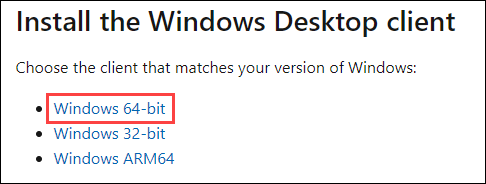
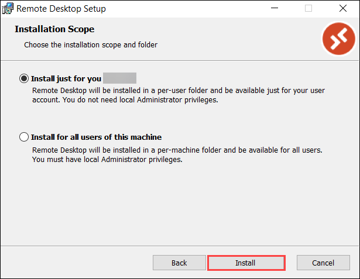
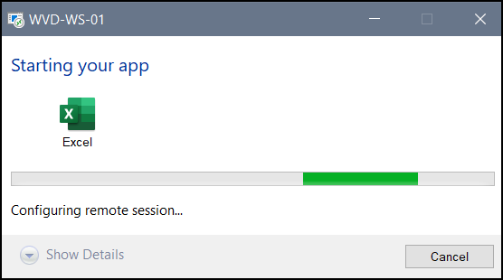
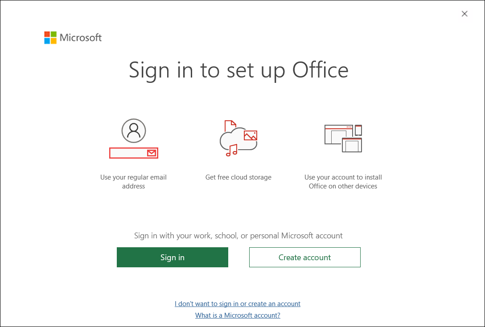

# **Exercise 6: Access the Published Applications/ Desktop using WVD Client**

WVD Client is a Windows Application through which we can connect to our windows virtual desktop environment.

## **Task 1: Access the Published Applications using WVD Client**

Now as we have published remote applications in previous exercises, here we will be accessing them using WVD Client.

1. Download the **WVD Client** on your local machine from the following [**Link**](https://docs.microsoft.com/en-us/azure/virtual-desktop/connect-windows-7-and-10) and install **Windows 64-bit** version by clicking on it.
   
   
   
   
2. Then open the setup and click **Next** on the Welcome page of setup.

3. Check the agreement box and click on **Next**.

4. On **Installation scope** window select **Install just for you** and then click on **Install**.

   

5. After installation, in your local machine go to **Start** and search for **Remote desktop** and open the application with exact icon as shown below.

   
   
   
6. After the application opens click on **Subscribe**.

   
  
  
7. Enter your **credentials** to access the workspace.

   - Username: **<inject key="AzureAdUserEmail" />** *and then click on **Next**.*
   
   

   - Password: **<inject key="AzureAdUserPassword" />** *and click on **Sign in**.*

   
   
   
8. Make sure to **uncheck** *Allow my organization to manage my device* and click on **This app only**.

   
   
   
9. Now double click on either Word or Excel application that you want to access. Here we are selecting **Excel**. 

   
   

10. Enter your **credentials** to access the Application.

   - Username: **<inject key="AzureAdUserEmail" />** 
   - Password: **<inject key="AzureAdUserPassword" />**
   
   
   

11. Wait for your application to connect.

   
   

12. Your Application will launch and will be ready to use.

    
    
13. You can close this Excel Application session now by clicking on close button.

   
   
## **Task 2: Access the Workspace Desktop using WVD Client**

In this task we will be accessing the desktop type application named *WVD-HP-01-DAG* created by default when we created *WVD-HP-01* host pool using WVD Client.

1. In your local machine go to **Start** and search for **Remote desktop** and open the Application with exact Icon as shown below.

   
 
2. Now double click on **WVD-HP-01-DAG** Desktop to access it.

   
   

3. Enter your **credentials** to access the Desktop.

   - Username: **<inject key="AzureAdUserEmail" />** 
   - Password: **<inject key="AzureAdUserPassword" />**
   
   
   

4. Wait for your Desktop to connect.

   
   

5. Your virtual desktop will launch and it should be ready to use.
        
      
    
     
6. Click on the **Next** button present in the bottom-right corner of this lab guide. 
