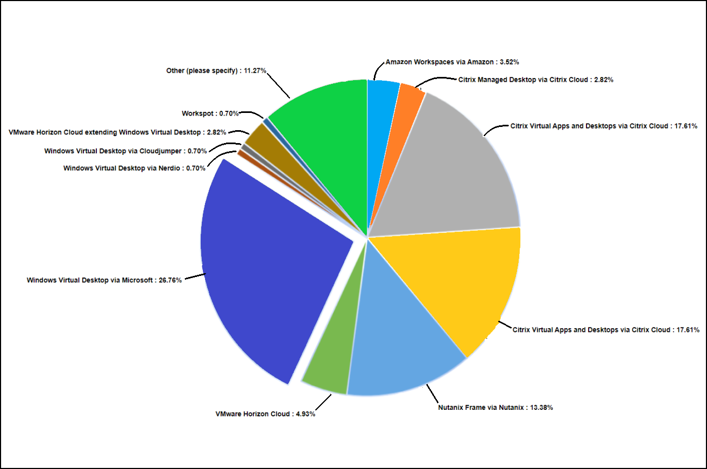

# **Summary**

## **These are the topics we covered in this lab:**

- Creating host pools of *Pooled* type and utilizing it as per the needs of the users/organizations.

- Deploying *session hosts* and using them to publish applications in Windows Virtual Desktop environment.

- Creating an application group of type *RemoteApp* and using the default *Desktop* application group.

- Creating *workspaces* to have an isolated/ differentiated environment for the user while using Windows Virtual Desktop. 

- Registering application groups to Workspace.

- Publishing applications using the *Start menu* in the RemoteApp type application groups.

- Assigning users to the application groups and workspaces to allow/restrict users from using certain applications.

- Accessing Windows Virtual Desktop and published applications through Browser and WVD Client application.

## **Why Windows Virtual Desktop?**

According to Gartner by 2023, 30% of all the on-premises VDI users will be accessing workspace in the cloud using DaaS!

The WVD-Essentials lab you just completed gives a complete walk-through on Windows Virtual Desktop essentials, making you confident enough to create and manage Windows Virtual Desktop as needed in the future.

It ensures that you are knowledgeable enough to set up a single session and multi-session Windows 10 deployment that delivers scalability, virtualize Microsoft 365 Apps for enterprise and optimize it to run in multi-user virtual scenarios.

