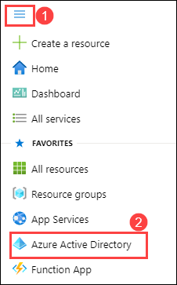
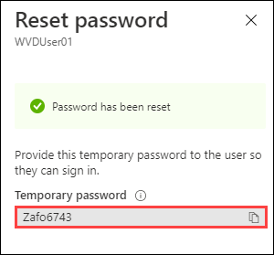
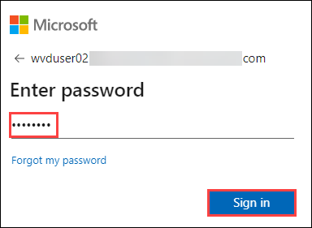
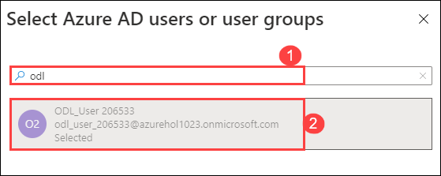
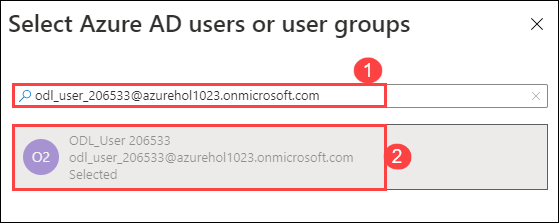
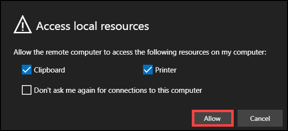
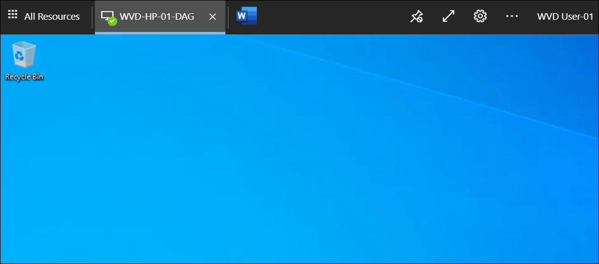

# **Exercise 7: Load Balancing methods**


### **Task 1: Understand the Load balancing methods in Host Pools**


While configuring  a host pool, we can select load balancing methods as per the needs.

There are two types of load balancing methods:

 **1. Breadth-first**: Breadth-first load balancing distributes new user sessions across all available session hosts in the host pool. 

 **2. Depth-first**:  Depth-first load balancing distributes new user sessions to an available session host with the highest number of connections but has not reached its maximum session limit threshold.


### **Task 2: Add new users to Azure Active Directory**

1. On theAzure Portal page, click on the **Show portals menu** button and select **Azure Active Directory**.

   

2. Click on **Users** under **Manage** blade.

   

3. Click on **+ New user** to add a new user.

   

4. Add the following configurations and leave rest to default:

   - User name: **WVDUser01**
   - Name: **WVDUser01**
   - Click on **Create**

   

5. Now again click on **+ New user**, then add the following configurations and leave rest to default.

   - User name: **WVDUser02**
   - Name: **WVDUser02**
   - Click on **Create**
   
   

6. Both the newly created users will show up similarly as shown below. Copy the **user principal name** of both users and keep in a text editor.

   

7. Click on **WVDUser01** to open it. Then click on **Groups** under *Manage* blade and select **+ Add memberships**.

   

8. Click on the **AAD DC Administrators** group and then click on **Select**.

   

9. Once done, open **Profile** under **Manage** blade. Click on the **Reset password** and then click on **Reset password** button.

   

10. Copy the temporary password and paste it in a text editor.

   

11. Repeat *Step 7* to *Step 10* for **WVDUser02**.


### **Task 3: Change and experience Load Balancing methods**


#### **A**. While creating WVD-HP-01 host pool we selected load balancing method as *Breadth-first*, now we are going to log into both the session hosts created inside the WVD-HP-01 host pool and see the user distribution.


>**Note:** You are already logged into WVD-HP-01-DAG using WVDUser01 when you performed ***Exercise 11, Task 2, Step 20***, if that session is closed then visit `aka.ms/wvdarmweb` and click on WVD-HP-01-DAG and login with *WVDUser-01* credentials.

1. In your local machine go to **Start** and search for **Remote desktop** and open the application with the exact icon as shown below.

   
   

2. Click on the *ellipses* and select **Unsubscribe**.

   

3. Click on **Subscribe** and enter you user credentials.

   - Username: Put the username of **WVD User-02** you copied earlier (for example: **WVDUser-02@azurehol1055.onmicrosoft.com**).
   
   
   
   - Password: *Paste the temporary password you copied earlier*

   

4. Portal will ask you to set a permanent password. For that just paste your temporary password under *Current Password* and add a new password for the user.

   

5. Now in the WVD client double click on the **WVD-HP-01-DAG** Desktop to access it. 

   

6. Enter your **credentials** to access the application and click on **Submit**.

   - Username: Put the username of **WVD User-02** (for example: **WVDUser-02@azurehol1055.onmicrosoft.com**).
   - Password: *Paste the permanent password*
   
   
  

7. The virtual Desktop will launch as shown below. 

    


8. Return to the Azure portal on your browser and search for the host pool and click on it.

   
   
   
9. Now click on **WVD-HP-01** host pool to access it.

   
   
   
10. Under Manage blade, click on **Session hosts**.

   
   
   
11. Now as you can see two session hosts have one Active sessions each.

   
   
>**Note:** This shows how users are divided into 2 different session host under *Breadth first load balancing methods*.
   
12. Click on the first session with one active session host and verify which user has been assigned to the particular session host and click on **Log off all active users**, then click on the **X** icon on the top right corner to return to the session host page.

   
    
>**Note:** We need to log off users from session hosts so that when the users login back to the session host, they are divided based on the depth first load balancing method.
   

#### **B**. Now we will change the load balancing method of WVD-HP-01 host pool to *Depth first* and see how users are divided between session hosts.

1. In *WVD-HP-01* host pool, click on **Properties** under *Settings* blade.

   
   
   
2. Change the load balancing algorithm to **Depth-first** then click on **Save icon**.

   
   
3. Now paste this link ```aka.ms/wvdarmweb``` in your browser and enter your **credentials** to login. 

   - Username: Put username **WVD User-01** which you copied earlier and then click on **Next**.
   
   

   - Password: *Paste the temporary password you copied earlier* and click on **Sign in**.

   
      
 4. Portal will ask you to set a permanent password. For that just paste your temporary password under *Current Password* and add new password for the user.

   

5. Now in the WVD client double click on the **WVD-HP-01-DAG** Desktop to access it. 

   

6. Select **Allow** on the prompt asking permission to *Access local resources*.

   

7. Enter your **credentials** to access the application and click on **Submit**.

   - Username: *Put the username of **WVD User-01** which you copied earlier (for example: **WVDUser-01@azurehol1055.onmicrosoft.com**)*
   
   - Password: *Paste the Permanent password that you created.*
   
   


8. The virtual Desktop will launch as shown below. 

   
   
   
9. In your local machine go to **Start** and search for **Remote desktop** and open the application with exact icon as shown below.

   
   

10. Now in the WVD client double click on the **WVD-HP-01-DAG** Desktop to access it. 

   

11. Enter your **credentials** to access the desktop and click on **Submit**.

   - Username: Put the username of **WVD User-02** which you copied in previous task (for example: **WVDUser-02@azurehol1055.onmicrosoft.com**)
   - Password: *Paste the permanent password that you created earlier*
   
   
   

12. The virtual Desktop will launch as shown below. 

    


13. Return back to azure portal and navigate to **WVD-HP-01** host pool.

   
   
   
14. Now as you can any one of the session host from  *WVD-HP01-SH-0* or *WVD-HP01-SH-1* will have 2 Active sessions, click on it.

   
   
>**Note:** This shows how both users are assigned into the same session host as *maximum limit per session was set to 5* under *Depth first load balancing method*
 that means first 5 users will be assigned to the the same session host, then the sixth user will be assigned to another session host.
 
   
15. Verify that both users have been assigned to the particular session host. 

   


# **Scale session hosts using Azure Automation**

Here, you will learn about the scaling tool built with the Azure Automation account and Azure Logic App that automatically scales session host VMs in your Windows Virtual Desktop environment. 

Please follow the link given below to know more about this feature. 

```
https://docs.microsoft.com/en-us/azure/virtual-desktop/set-up-scaling-script
```

Click on the **Next** button present in the bottom-right corner of this lab guide.

