# **Exercise 7: Load Balancing methods**

Windows Virtual Desktop supports two load-balancing methods. Each method determines which session host will host a user's session when they connect to a resource in a host pool.
While configuring  a host pool, we can select load balancing methods as per the needs.

The following load-balancing methods are available in Windows Virtual Desktop:

 **1. Breadth-first**: Breadth-first load balancing distributes new user sessions across all available session hosts in the host pool. 

 **2. Depth-first**:  Depth-first load balancing distributes new user sessions to an available session host with the highest number of connections but has not reached its maximum session limit threshold.


### **Task 1: Add new users to Azure Active Directory**

1. In Azure Portal, click on the **Show portals menu** button and select **Azure Active Directory**.

   

2. Click on **Users** under *Manage* blade.

   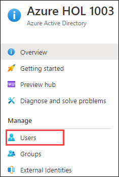

3. Click on **+ New user** to add a new user.

   

4. Add the following configurations and leave rest to default:

   - User name: **WVDUser01**
   - Name: **WVDUser01**
   - Click on **Create**.

   

5. Click on **+ New user** to add one more user, then add the following configurations and leave rest to default.

   - User name: **WVDUser02**
   - Name: **WVDUser02**
   - Click on **Create**
   
   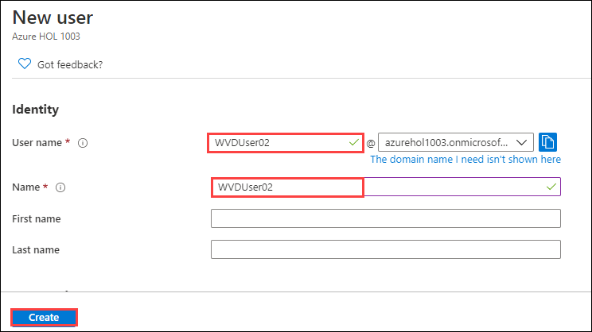

6. Both the newly created users will show up similarly as shown below. Copy the **user principal name** of both users and paste in a text editor so that we can use it further.

   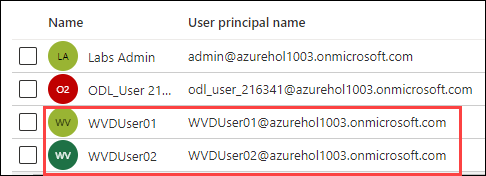

7. Click on **WVDUser01** to open it. Then click on **Groups** under *Manage* blade and select **+ Add memberships**.

   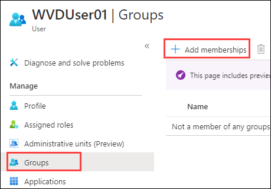

8. Click on the **AAD DC Administrators** group and then click on **Select**.

   

9. Once done, open **Profile** under *Manage* blade. Click on the **Reset password** and then click on **Reset password** button.

   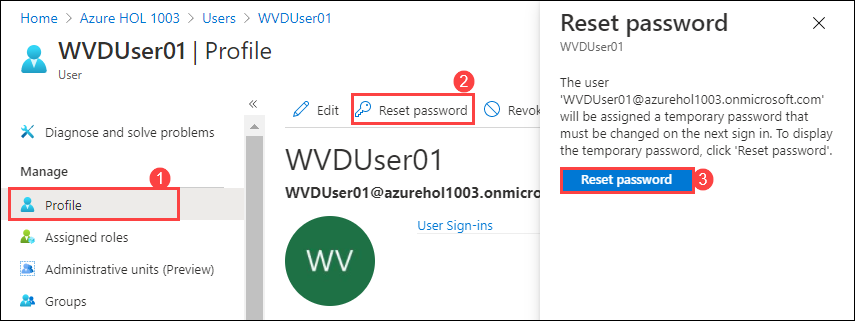

> **Note:** This password change process causes the password hashes for Kerberos and NTLM authentication to be generated and stored in Azure AD. The account isn't synchronized from Azure AD to Azure AD DS until the password is changed. It takes a few minutes after you've changed your password for the new password to be usable in Azure AD DS and to successfully sign in to computers joined to the managed domain.

10. Copy the ***Temporary Password*** and paste it in a text editor.

   

> **Note:** Make sure you have noted down the ***Username*** and ***Temporary Password*** for ***WVDUser01***, similar to the screenshot below.
>
>  

11. Repeat *Step 7* to *Step 10* for **WVDUser02**.

> **Note:** Make sure you have noted down the ***Username*** and ***Temporary Password*** for ***WVDUser02***, similar to the screenshot below.
>
>  

12. Navigate to the host pool *WVD-HP-01* and open **Application groups** present under *Manage* blade. Two application groups will be listed there.

   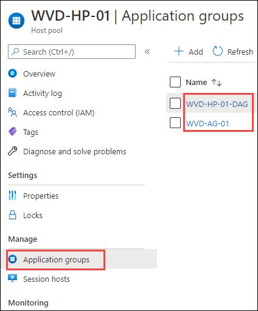

13. Open application group **WVD-HP-01-DAG** and click on **Assignments** under *Manage* blade.

   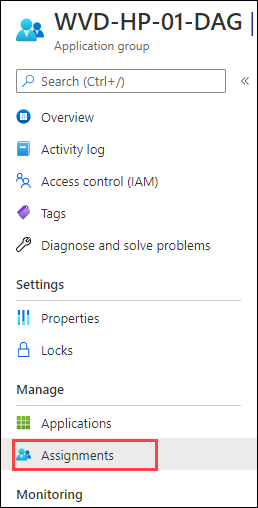
   
14. Click on **+ Add**, then in the search bar, type *WVDUser* and select both **WVDUser01** & **WVDUser02** that we created earlier. At last, click on **Select** button.

   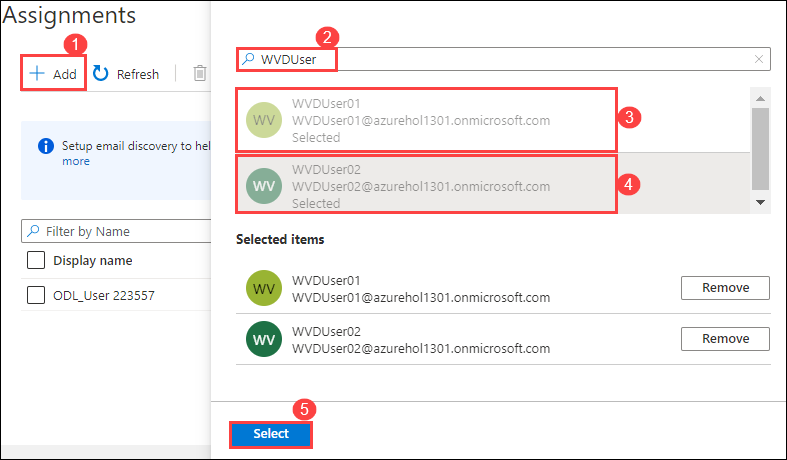

15. Once done, the users assigned to the Application group will look similar to the image given below.

   


### **Task 2: Change and experience Load Balancing methods**


**A**. **Breadth-first**
   
While creating WVD-HP-01 host pool, we selected load balancing method as *Breadth-first*.  Now we are going to log in to Desktop App created on WVD-HP-01 with both users simultaneously and see the user distribution.


1. Paste this link ```aka.ms/wvdarmweb``` in your browser and enter your **credentials** to login. 

   - Username: *Paste username* **WVDUser01** *which you copied earlier and then click on **Next**.*
   
   

   - Password: *Paste the temporary password you copied in Task 1: Step 10* and click on **Sign in**.

   
 

2. Portal will ask you to set a ***permanent password***. Paste your temporary password that you copied in Task 1: Step 10, under *Current Password* and add new password for the user.This new password will act as the ***Permanent Password*** for *WVDUser01*.

   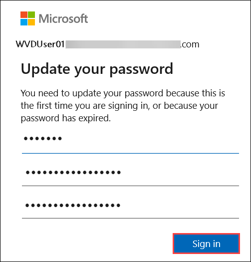

3. Now in the WVD dashboard, click on the **Default Desktop** to access it. 

   

4. Select **Allow** on the prompt asking permission to *Access local resources*.

   

5. Enter your **credentials** to access the application and click on **Submit**.

   - Username: *Paste username of* **WVDUser01** *which you copied earlier(for example: **WVDUser01@azurehol1055.onmicrosoft.com**)*
   
   - Password: *Paste the **Permanent password** that you created in Task 2:Step 2.*
   
   


6. The virtual Desktop will launch as shown below. 

   
   
7. Navigate to your local machine, go to **Start** and search for **Remote desktop** and open the application with the exact icon as shown below.

   
   
8. Click on the *ellipses* and select **Unsubscribe**. Click on **Yes** for any warning.

   

> **Note:** We need to unsubscribe from the feed, because in Exercise 4 we subscribed to WVD feed using a different user.

9. Click on **Subscribe** button.

   

10. Enter the user credentials to access the workspace.

   - Username: *Paste username of* **WVDUser02** *which you copied earlier(for example: **WVDUser02@azurehol1055.onmicrosoft.com**), then click on **Next**.*
   
   - Password: *Paste the temporary password you copied in Task 1: Step 11*.

   

11. Portal will ask you to set a ***permanent password***. Paste your temporary password that you copied in Task 1: Step 11, under *Current Password* and add a new password for the user. This new password will act as the ***Permanent Password*** for *WVDUser02*.

   

12. In WVD client, double click on the **Default Desktop** to access it. 

   

13. Enter your **credentials** to access the application and click on **Submit**.

   - Username: *Paste username of* **WVDUser02** *which you copied earlier(for example: **WVDUser02@azurehol1055.onmicrosoft.com**)*
   - Password: *Paste the **permanent password** you created in Task 2:Step 2., and click on **OK**.* 
   
   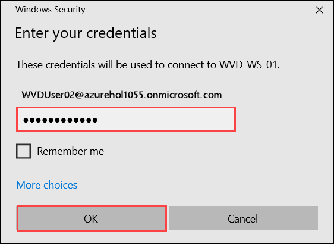
  

14. The virtual Desktop will launch as shown below. 

    


15. Return to the Azure portal on your browser and search for the host pool and click on it.

   
   
   
16. Now click on **WVD-HP-01** host pool to access it.

   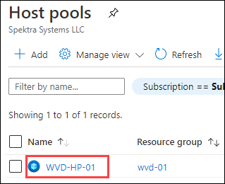
   
   
17. Under Manage blade, click on **Session hosts**.

   
   
   
18. You can see that both session hosts have one Active sessions each.

   
   
> **Note:** This shows how users are distributed among different session hosts under *Breadth-first load balancing method*. The breadth-first method first queries session hosts that allow new connections. The method then selects a session host randomly from half the set of session hosts with the least number of sessions. 
   
19. Open **WVD-HP01-SH-0** session host, there you can see the user logged in to that session host. Now click on **Log off all active users** button and select **Yes** to the prompt asking *Do you want to Log off active users of the virtual machine*.

   

20. Navigate back to *Session hosts* and open **WVD-HP01-SH-1** session host, there you can see the user logged in to that session host. Now click on **Log off all active users** button and select **Yes** to the prompt asking *Do you want to Log off active users of the virtual machine*.

   

>**Note:** We need to log off the users from session hosts so that when the users login again, connection is made based on the *Depth-first load balancing method*.
   

**B**. **Depth first**

Here we will change the load balancing method of *WVD-HP-01* host pool to *Depth first* and see how user distribution changes in the Host pool.

> **Note:** If previous session is closed, visit to  `aka.ms/wvdarmweb`, then click on *Default Desktop* and login with *WVDUser01* credentials.

1. In *WVD-HP-01* host pool, click on **Properties** under *Settings* blade.

   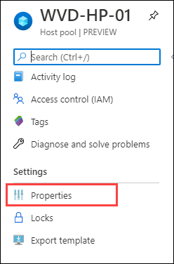
   
   
2. Change the load balancing algorithm to **Depth-first** then click on **Save icon**.

   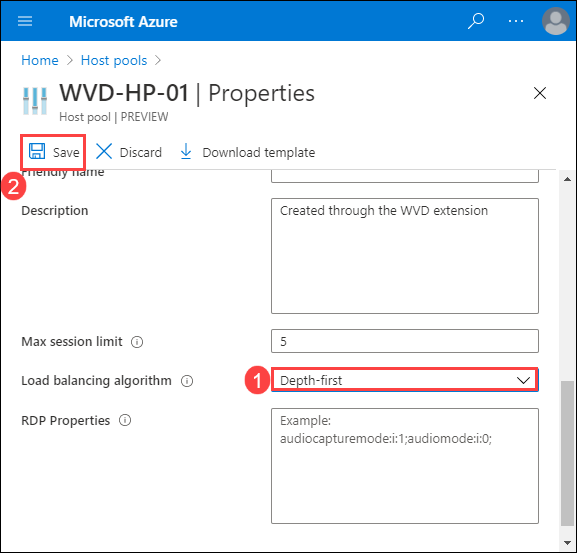
   
3. Now paste this link ```aka.ms/wvdarmweb``` in your browser and enter your **credentials** to login. 

   - Username: *Paste username of* **WVDUser01** *which you copied earlier(for example: **WVDUser01@azurehol1055.onmicrosoft.com**)* and then click on **Next**.
   
   

   - Password: *Paste the **Permanent password** that you created in Task 2:Step 2., and click on **Sign in**.*

   
 

4. In the WVD dashboard, click on the **Default Desktop** to access it. 

   

5. Select **Allow** on the prompt asking permission to *Access local resources*.

   

6. Enter your **credentials** to access the application and click on **Submit**.

   - Username: *Paste username of* **WVDUser01** *which you copied earlier(for example: **WVDUser01@azurehol1055.onmicrosoft.com**)*
   
   - Password: *Paste the **Permanent password** that you created in Task 2:Step 2.*
   
   


7. The virtual Desktop will launch as shown below. 

   
   
   
8. In your local machine, go to **Start** and search for **Remote desktop** and open the application.

   
   

9. Now in the WVD client double click on the **Default Desktop** to access it. 

   

10. Enter your **credentials** to access the desktop and click on **Submit**.

   - Username: *Paste username of* **WVDUser02** *which you copied earlier(for example: **WVDUser02@azurehol1055.onmicrosoft.com**).*
   - Password: *Paste the **permanent password** that you created in Task 2:Step 2.*
   
   
   

11. The virtual Desktop will launch as shown below. 

    


12. Return back to the Azure portal, navigate to **WVD-HP-01** host pool and open **Session Hosts** present under *Manage* blade.

   
   
   
13. Here one of the session hosts, either *WVD-HP01-SH-0* or *WVD-HP01-SH-1* will have 2 Active sessions. Click on that session host to open it.

   
   
> **Note:** The depth-first method first queries session hosts that allow new connections and haven't gone over their maximum session limit. The method then selects the session host with highest number of sessions. If there's a tie, the method selects the first session host in the query.
 
   
14. Verify that both users have been assigned to the particular session host. 

   


Please follow the link given below to know more about Load-Balancing Method.

```https://docs.microsoft.com/en-us/azure/virtual-desktop/host-pool-load-balancing#breadth-first-load-balancing-method```


## **Scale session hosts using Azure Automation**

Here, you will learn about the scaling tool built with the Azure Automation account and Azure Logic App that automatically scales session host VMs in your Windows Virtual Desktop environment. 

Please follow the link given below to know more about this feature. 

```https://docs.microsoft.com/en-us/azure/virtual-desktop/set-up-scaling-script```


Click on the **Next** button present in the bottom-right corner of this lab guide.

